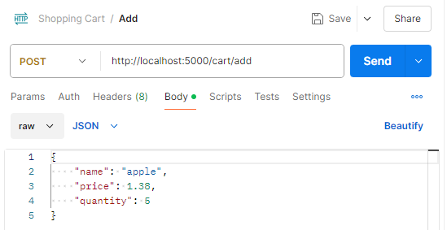
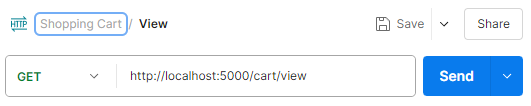

# Shopping Cart Backend

Hello! As part of the Philips Coding Challenge, I've implemented a simple backend for a shopping cart service using Flask and PostgreSQL. The service currently supports the ability to add items to the cart and as view all items in the cart.

## Local Setup

To run this API locally, there are a few prerequisites.

-   Python must be installed, download [here](https://www.python.org/downloads/)!
-   PostgreSQL must be installed, download [here](https://www.enterprisedb.com/downloads/postgres-postgresql-downloads)!

After cloning down the repository from GitHub, there are a few more steps.

1. (Optional) Create a virtual environment to manage dependencies. On windows, the environment can be created and activated with the following scripts. macOS commands and other details can be found [here](https://flask.palletsprojects.com/en/3.0.x/installation/#virtual-environments).

```
py -3 -m venv .venv
```

```
.venv\Scripts\activate
```

2. Install the required Python packages.

```
pip install -r requirements.txt
```

3. Create a .env file for your environment variables at the root of the project.

```
FLASK_APP=server
DB_NAME=postgres
DB_USERNAME=postgres
DB_PASSWORD=<YOUR_PASSSWORD_HERE>
DB_HOST=localhost
DB_PORT=5432
```

4. Now you can start the server!

```
flask run
```

## How to Test

I'm going to demonstrate how to test the API using Postman.

To add an item to the cart, send a POST request to `http://localhost:5000/cart/add` with the object data in JSON format. Note that name, price, and quantity are required properties.



To view all items in the cart, send a GET request to `http://localhost:5000/cart/view`.


